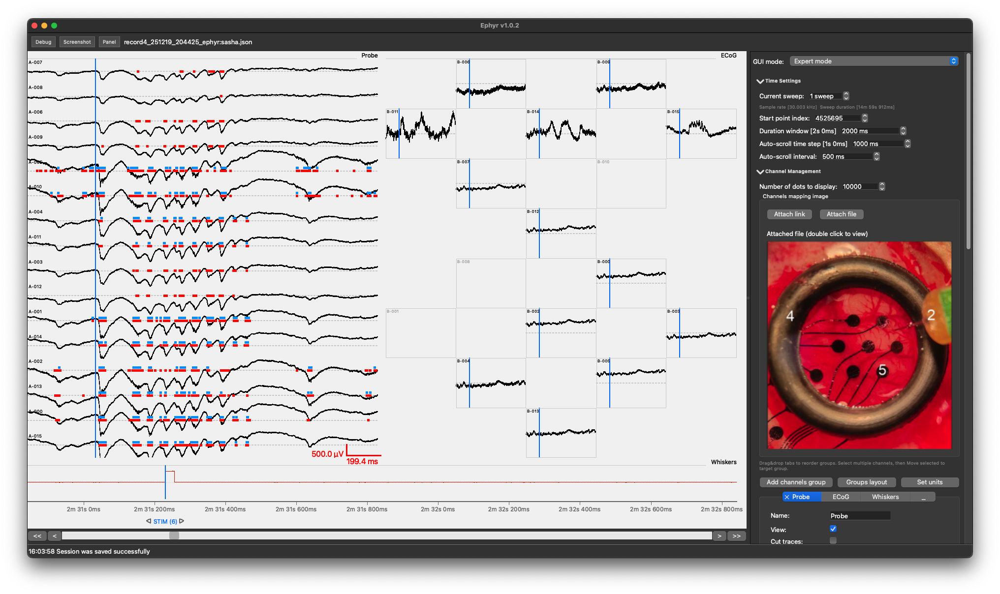

# Ephyr

Ephyr is a lightweight yet powerful environment for labelling electrophysiological data. It combines an adaptive interface with intelligent performance scaling to match your machine’s resources, ensuring stable real-time operation even under heavy loads.

Fully open-source and built in Python, the platform provides a flexible API for post-annotation data access. Its add-on architecture lets you extend functionality seamlessly without modifying the core codebase.

**Documentation:** [https://ephyr.readthedocs.io/](https://ephyr.readthedocs.io/)

## Citation

### Software

If you use this application in your research, please cite the software itself using the Zenodo DOI:

> Kireev, A., & Suchkov, D. (2026). *Ephyr: an open-source platform for visualizing and labeling multimodal electrophysiological data* (Version 1.0.4). Zenodo. https://doi.org/10.5281/zenodo.21703394

### Article (Coming Soon)

A peer-reviewed article describing this application is currently in preparation.
We kindly ask that you consider citing it once it is published.
The official reference and DOI will be updated here and in the `CITATION.cff` file upon publication.

---

## License

Copyright (C) 2026 Life Improvement by Future Technologies (LIFT).

This project is licensed under the **GNU General Public License v3.0** —
see the [LICENSE](LICENSE) and [COPYRIGHT](COPYRIGHT) files for details.
