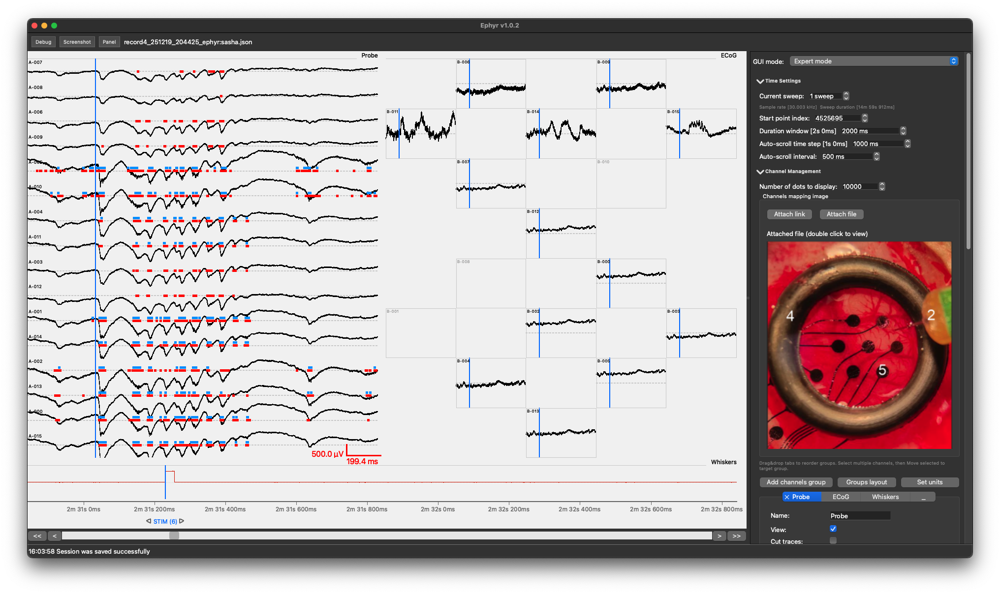

# Ephyr

[](https://ephyr.readthedocs.io/)
[](LICENSE)

Ephyr is a lightweight yet powerful environment for labelling electrophysiological data. It combines an adaptive interface with intelligent performance scaling to match your machine’s resources, ensuring stable real-time operation even under heavy loads.

Fully open-source and built in Python, the platform provides a flexible API for post-annotation data access. Its add-on architecture lets you extend functionality seamlessly without modifying the core codebase.



**Documentation:** [https://ephyr.readthedocs.io/](https://ephyr.readthedocs.io/)

## Citation

### Software

If you use this application in your research, please cite the software itself using the Zenodo DOI:

> Kireev, A., & Suchkov, D. (2026). *Ephyr: an open-source platform for visualizing and labeling multimodal electrophysiological data* (Version 1.0.5). Zenodo. https://doi.org/10.5281/zenodo.21719977

### Article (Coming Soon)

A peer-reviewed article describing this application is currently in preparation.
We kindly ask that you consider citing it once it is published.
The official reference and DOI will be updated here and in the `CITATION.cff` file upon publication.

---

## License

Copyright (C) 2026 Life Improvement by Future Technologies (LIFT).

This project is licensed under the **GNU General Public License v3.0** —
see the [LICENSE](LICENSE) and [COPYRIGHT](COPYRIGHT) files for details.


## Development

Contributions are welcome via pull requests. To contribute:

1. Fork the repository.
2. Create a branch for your change.
3. Make your changes and commit them using the commit message convention below.
4. Open a pull request against the main branch.

Please keep pull requests focused and describe the motivation, changes, and testing performed.

### Commit message convention

This project follows [Conventional Commits](https://www.conventionalcommits.org/). Use one of the following prefixes in your commit messages.

**Core Conventional Commits types:**

| Type | Meaning | When to use | Example |
|---|---|---|---|
| `feat` | New feature | Adds new functionality | `feat: add dark mode` |
| `fix` | Bug fix | Fixes incorrect behavior | `fix: handle null user ID` |
| `docs` | Documentation | README, comments, guides only | `docs: update install steps` |
| `style` | Code style/formatting | Whitespace, formatting, semicolons — no logic change | `style: format with Prettier` |
| `refactor` | Refactoring | Code change that neither fixes a bug nor adds a feature | `refactor: simplify validation logic` |
| `perf` | Performance | Improves speed or memory usage | `perf: cache user lookup` |
| `test` | Tests | Add or fix tests | `test: add parser edge cases` |
| `build` | Build system/dependencies | Build tooling, bundler, package manager, external deps | `build: upgrade webpack to v5` |
| `ci` | Continuous integration | CI config/scripts, GitHub Actions, GitLab CI, Travis | `ci: add test workflow` |
| `chore` | Maintenance | Routine tasks not touching src or tests | `chore: update .gitignore` |
| `revert` | Revert | Reverts a previous commit | `revert: feat: add dark mode` |

Example commit messages:

```text
feat: add support for EDF+ files
fix(ui): prevent crash when no channel is selected
docs: update installation instructions
```

Breaking changes can be marked with `!` after the type or scope, or with a `BREAKING CHANGE:` footer:

```text
feat!: drop Python 3.9 support
fix(api)!: change response format
```

### Changelog

To generate `CHANGELOG.md` use:

```bash
changelog-maestro --template devtools/changelog.md.j2
```