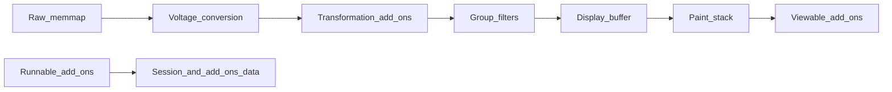
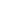
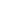

# Add-ons Workflow

Add-ons extend Weegit without changing the core application. Each add-on is a Python class that can
enable any combination of three capabilities:

| Type | What it does | Where it fits |
|------|----------------|---------------|
| **Transformation** | Changes the numeric samples used for display | Inside the display data pipeline, after int16→voltage conversion and **before** channel-group filters |
| **Viewable** | Draws overlays on the signal panel | In the paint stack, layered with traces, periods, and events according to a z-index |
| **Runnable** | Runs an interactive or batch tool when you click **Run** | Outside the continuous redraw loop; reads the session and data, may write under `add_ons/data/<module>/`, and may open dialogs |

One package can combine capabilities (for example Runnable + Viewable).

## Logical data flow

1. Raw int16 samples are read from `data/sweep_*/*.samples`.
2. Values are converted to voltage for display.
3. Enabled **Transformation** add-ons reshape those samples per channel (when applicable).
4. Channel-group filters run next.
5. The result is downsampled into the display buffer drawn as traces.
6. **Viewable** add-ons paint additional graphics on top (or underneath, depending on z-index).
7. Separately, **Runnable** add-ons are started from the Add-ons panel. They can detect events, compute
   analyses, or write result files that other Viewable tools later overlay.

Session toggles for View / Transform are stored in `gui_setup.add_ons`. Persistent outputs usually live
under `{experiment}_weegit/add_ons/data/$ADD_ON_MODULE_NAME/`.

## Example: Viewable — Spike viewer

**Spike viewer** overlays spike markers on the signal panel from detection results produced by Spike
detection (or compatible tools). You typically **Run** it once to choose which detection result folders
to display, then enable **View** so markers appear while you navigate the recording.

## Example: Runnable — Events detection

**Events detection** is a Runnable add-on that scans selected channels (TTL edge crossings or peaks above
a threshold) and appends detections to the session event vocabulary. After it finishes, the new events
appear in the signal panel and in the events table like manually placed labels.

For installing, searching, and running add-ons from the UI, see [Usage](usage.md).
For scaffolding your own module, see [Add-on Development](development.md).
