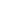
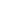

# Add-ons Usage

## Manage installed packages

Open **Add-ons → Manage**.

The dialog loads the remote catalog and shows:

| Area | Purpose |
|------|---------|
| **Left list** | Available packages with install state and name |
| **Details** | Module name, version (remote and installed), author, keywords, links, and description |
| **Install** | Downloads and installs the selected package into the Weegit environment |
| **Update** | Upgrades an already installed package |
| **Uninstall** | Removes the package and cleans related session toggles / experiment `add_ons/data` for that module |

Use Manage when you want to add tools from the published catalog, keep them up to date, or remove ones
you no longer need. Package sources are published in the
[weegit-add-ons](https://github.com/misisisim/weegit-add-ons) repository.

## Search and run from the side panel

Show the Add-ons section with **View → Tools → Add-ons** (or ensure the right panel is visible via **Panel**).

| Control | Purpose |
|---------|---------|
| **Search** | Filters the list by add-on label |
| Groups | Installed distributions and **Development add-ons** (`dev_*` modules loaded from `./add_on_development`) |
| **View** | Enables Viewable drawing when the add-on supports it |
| **Transform** | Enables Transformation in the display pipeline when supported |
| **Run** | Starts a Runnable add-on; progress may appear in a loading dialog |

Typical workflow:

1. Install the package from Manage (or develop locally under `add_on_development`).
2. Open the side panel and find the add-on.
3. Click **Run** if it needs configuration or batch processing.
4. Enable **View** and/or **Transform** so results affect the signal panel while you annotate.

See [Workflow](index.md) for how the three capability types interact with signal data.
