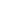

# Main Window

When an experiment session is open, the Weegit window is organized as follows.

## Layout overview

| Region | Role |
|--------|------|
| **Menu** | Global actions: open experiments, manage sessions, toggle visibility, label events/periods, manage add-ons, and open Help. See [Menu](menu.md). |
| **Header bar** | **Screenshot** exports the current signal view (PNG/SVG). **Panel** shows or hides the right-hand settings panel. The label shows the current experiment and session name. |
| **Signal panel** (left) | Channel groups with traces, events, periods, optional add-on overlays, and time navigation. See [Signal Panel](signal_panel.md). |
| **Settings panel** (right) | GUI mode, time and channel settings, experiment description, add-ons list, and application logs. See [Settings Panel](settings_panel.md). |
| **Status bar** | Timestamped status messages from the application. |

Before any experiment is loaded, the left area shows a start screen with a quick Open action and a short hotkey list.

## Signal panel highlights

Inside the signal panel you will typically work with:

- **Channel groups** — arranged traces for one or more electrode groups
- **Events** — point markers on the time axis
- **Periods** — labeled time intervals
- **Tools** — measurement bar, area selection, and interactive labeling modes
- **Add-on overlays** — drawings from Viewable add-ons (for example spike markers)
- **Time controls** — scrollbar, step buttons, and auto-scroll for navigating the recording

## Settings panel highlights

The right panel starts with **GUI mode** (Beginner / Expert). Additional sections are toggled from
**View → Tools**: Electrophys trace settings, Information, Add-ons, and Logs.
