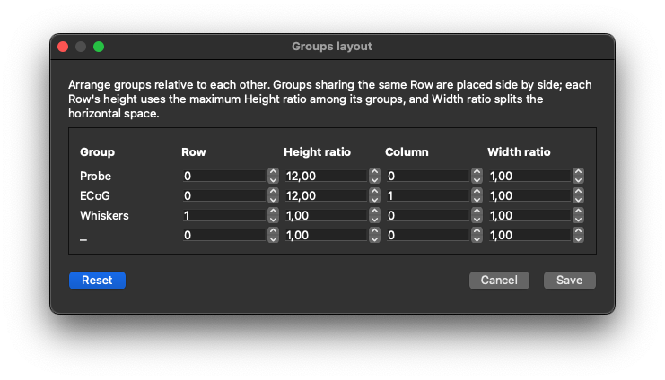
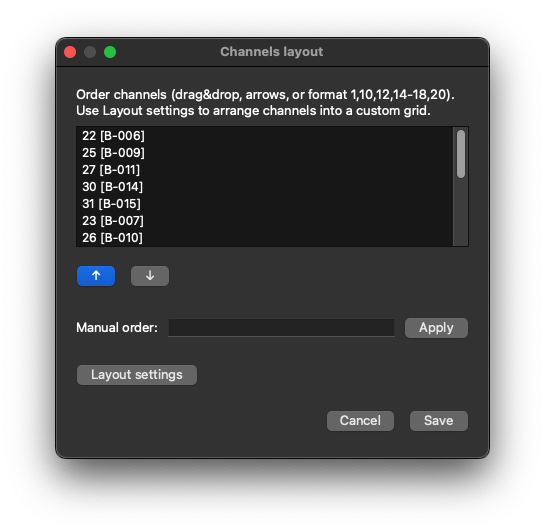
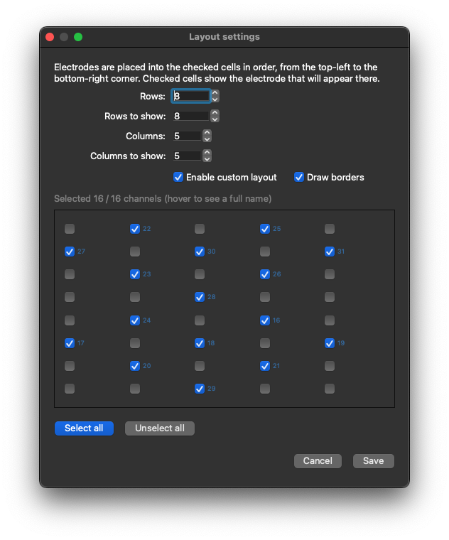

# Settings Panel

The right-hand settings panel holds tools that configure the view, describe the experiment, run add-ons,
and inspect logs. Show or hide individual sections from **View → Tools**, or use the **Panel** button in
the header bar to hide the entire panel.

## GUI mode

At the top of the panel, choose **Beginner mode** or **Expert mode**.

The choice is stored in Ephyr’s global user settings and applied whenever you open the app.
Expert mode reveals additional Channel Management controls (see below). All other menus and panels
remain available in both modes.

## Time settings

Part of **Electrophys trace settings** (View → Tools → Electrophys trace settings). Available in
Beginner and Expert modes.

| Control | Purpose |
|---------|---------|
| **Current sweep** | Selects which sweep is displayed (1-based in the UI). Sample rate and sweep duration are shown underneath. |
| **Start point index** | Sample index where the visible time window starts. |
| **Duration to show** | Length of the visible window in milliseconds. Changing duration keeps the window center fixed when possible. |
| **Auto-scroll time step** | Step size (ms) used by the `<` / `>` buttons and by auto-scroll. |
| **Auto-scroll interval** | Timer interval (ms) between auto-scroll steps when `<<` / `>>` is active. |

These values are stored in the session’s `gui_setup` and drive the signal panel and navigator.

## Channel Management

Also under **Electrophys trace settings**. Use this section to organize electrodes into groups, apply
filters, set units, and control how groups and channels are laid out on screen.

### Global controls

| Control | Mode | Purpose |
|---------|------|---------|
| **Number of dots to display** | **Expert only** | Target number of plotted points after downsampling. Lower values improve performance; higher values show more detail. |
| **Channels mapping image** | **Expert only** | Attach a probe/array map via URL or local file (stored in the session). Preview appears in the panel; double-click opens a larger view; you can open the link externally. |
| **Add channels group** | Both | Creates a new empty channel-group tab. |
| **Groups layout** | Both | Opens a dialog to place groups on a shared grid (row, column, height ratio, width ratio). |
| **Set units** | Both | Opens header units management so you can change voltage units for selected channels. |

### Groups layout

**Groups layout** controls how multiple channel groups share the signal panel:

- Groups on the **same row** appear side by side.
- **Height ratio** and **width ratio** allocate space within the row/column.
- **Reset** restores a simple default arrangement.

### Per-group tabs

Each channel group has its own tab (tabs can be reordered; empty groups can be closed).

| Field / action | Purpose                                                                                                                                                                                                                                  |
|----------------|------------------------------------------------------------------------------------------------------------------------------------------------------------------------------------------------------------------------------------------|
| **Name** | Title of the group.                                                                                                                                                                                                                      |
| **View** | Show or hide this group on the signal panel.                                                                                                                                                                                             |
| **Cut traces** | Clip drawn traces to each channel cell’s bounds.                                                                                                                                                                                         |
| **Auxiliary channels** | Marks the group as auxiliary. Auxiliary groups expose per-channel scale, Y offset, and color, and do not use the same “number to show” windowing as regular groups. Disabling a channel in an aux group can reset its style to defaults. |
| **Group filters** | Choose a filter type (Butterworth low/high/band-pass, Chebyshev band-pass, Notch), set parameters (cutoff, order, ripple, Q, and so on), and enable or disable each filter. **Disable all** turns every filter off for the group.        |
| **Common Scale / Y offset / Color** | Applied to all channels in non-auxiliary groups.                                                                                                                                                                                         |
| **Channel list** | Enable checkbox, channel index and name, free-text **Info** field. Auxiliary rows also show per-channel Scale / Y / Color.                                                                                                               |
| **Layout** | Opens the channel layout dialog for this group (order + optional grid).                                                                                                                                                                  |
| **Enable all / Disable all** | Toggles the enabled set for the group.                                                                                                                                                                                                   |
| **Move selected to** | Moves selected channels to another group.                                                                                                                                                                                                |

### Channel layout

Click **Layout** on a group to open **Channels layout**:

- Reorder channels by drag-and-drop, up/down buttons, or a manual index list such as `1,10,12,14-18,20`.
- Open **Layout settings** for the electrode grid editor.
- Save applies the new order and layout table to the group.

### Layout settings

The **Layout settings** dialog configures a custom grid for the group:

| Control | Purpose |
|---------|---------|
| **Rows / Columns** | Full size of the electrode grid. |
| **Rows to show / Columns to show** | Visible window size (use the group minimap on the signal panel to pan). |
| **Enable custom layout** | Use the grid instead of a single-column classic stack. |
| **Draw borders** | Draw cell borders around channels on the plot. |
| Grid checkboxes | Checked cells receive electrodes in channel order (top-left to bottom-right). Select all / Unselect all helpers are available. The number of checked cells must not exceed the number of channels in the group. |

## Experiment description

Shown when **View → Tools → Information** is enabled.

A single free-text editor stores notes for the experiment/session (`experiment_description` in the
session JSON). Use it for protocols, animal IDs, or any free-form context you want next to the labels.

## Add-ons

Shown when **View → Tools → Add-ons** is enabled.

Provides search, View / Transform checkboxes (when the add-on supports those capabilities), and a **Run**
button for Runnable add-ons. See [Add-ons Usage](../add_ons/usage.md) for install/manage workflows and
[Add-ons Workflow](../add_ons/index.md) for how the three add-on types fit together.

## Application Logs

Shown when **View → Tools → Logs** is enabled.

| Control | Purpose |
|---------|---------|
| Log list | Live, color-coded messages from the application logger (list size is capped). |
| **Filter** | Restrict by level: ALL, DEBUG, INFO, WARNING, ERROR, CRITICAL. |
| **Clear** | Clears the on-screen list. |
| **Open** | Opens the log file on disk in the system viewer. |
