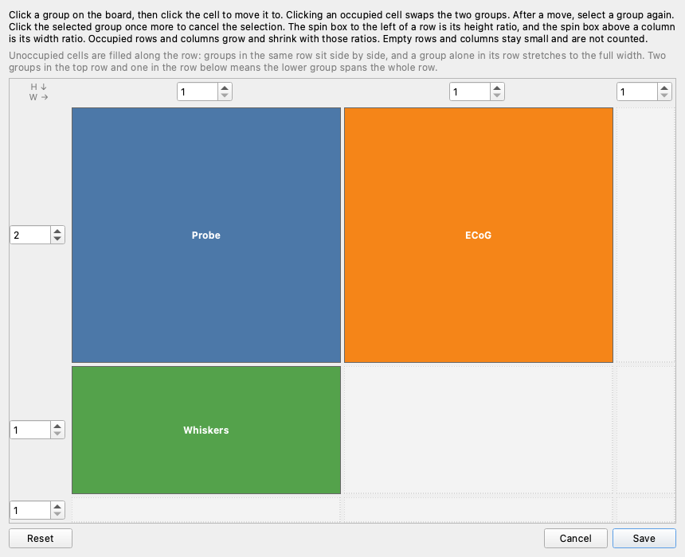
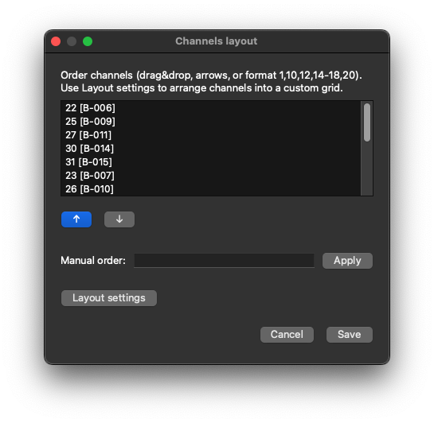
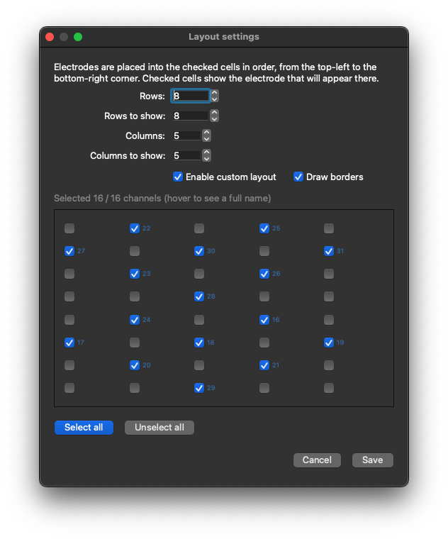

# Session Panel

The right-hand settings panel holds tools that configure the view, describe the experiment, run add-ons,
and inspect logs. Show or hide individual sections from **View → Session Panel**, or use **Show session panel** in
the header bar to hide the entire panel.

## Session panel

At the top of the panel, choose **Beginner mode** or **Expert mode**.

The choice is stored in Ephyr’s global user settings and applied whenever you open the app.
Expert mode reveals additional Timeline settings and Channel Management controls (see below).

## Recording navigation

An independent right-panel section enabled with **View → Session Panel → Recording Navigation**.

| Control | Mode | Purpose |
|---------|------|---------|
| Sweep info | Both | Sample rate and duration of the current sweep. |
| **Current sweep** | Both | Selects which sweep is displayed (1-based in the UI). Disabled when the recording has a single sweep. |
| **Set overlay** | Both | Choose other sweeps to draw in gray behind the current one, with the same filters and transformations. Disabled when the recording has a single sweep. |

## Timeline settings

An independent right-panel section enabled with **View → Session Panel → Timeline Settings**.

| Control | Mode | Purpose |
|---------|------|---------|
| **Start point** | **Expert only** | Start of the visible window in milliseconds, with a `[h m s ms]` readout like duration. Stored as a sample index (`start_point`); the displayed value is `floor(index * 1000 / sample_rate)`. |
| **Duration to show** | Both | Length of the visible window in milliseconds. Changing duration keeps the window center fixed when possible. |
| **Timebar step** | **Expert only** | Step size (ms) used by the `<` / `>` buttons and by auto-scroll. |
| **Auto-scroll frame delay** | **Expert only** | How often the view advances while `<<` / `>>` is active, in milliseconds. New sessions default to 1000 ms. |
| **Number of points to display** | **Expert only** | Target number of plotted points after downsampling. Lower values improve performance; higher values show more detail. |

In **Beginner mode** the timebar step is not shown. Ephyr keeps it at half of **Duration to show** and updates it whenever that window changes. The frame delay stays at its stored value (1000 ms by default).

These values are stored in the session’s `gui_setup` and drive the signal panel and navigator.

## Channel management

An independent right-panel section enabled with **View → Session Panel → Channel Management**. Use it to
organize electrodes into groups, apply filters, set units, and control how groups and channels are
laid out on screen.

### Global controls

| Control                       | Mode | Purpose |
|-------------------------------|------|---------|
| **Add channels group**        | **Expert only** | Creates a new empty channel-group tab. Disabled in Beginner mode. |
| **Groups layout**             | **Expert only** | Opens an N×N grid (N is the number of groups). Click a group on the board, then click the cell to move it to, and set row and column ratios. Disabled in Beginner mode. |
| **Set units**                 | **Expert only** | Opens header units management so you can change voltage units for selected channels. Disabled in Beginner mode. |

### Groups layout

**Groups layout** opens an N×N grid, where N is the number of channel groups. Click a group on the board to select it, then click the cell to move it to. Each group occupies one cell; clicking an occupied cell swaps the two groups. After a move, the selection is cleared, so the next move starts by selecting a group again. Click the selected group a second time to cancel the selection without moving it.

The spin box to the left of a row is its **height ratio**, and the spin box above a column is its **width ratio**. Occupied rows and columns in the grid grow and shrink with those ratios. Empty rows and columns stay small and are not counted.

On the signal panel, groups that share a row are drawn side by side, and **width ratio** splits that row between them. Unoccupied cells are filled along the row and do not leave a gap. A group that is the only one in its row stretches across the full width. For example, two groups in the top row and one group in the row below: the lower group spans the whole row. **Height ratio** is that row's share of the vertical space; the row uses the largest height ratio among its groups.

**Reset** stacks every group in the first column with ratios of 1. Nothing is applied until you press **Save**.

### Per-group tabs

Each channel group has its own tab (tabs can be reordered; empty groups can be closed).

| Field / action | Purpose                                                                                                                                                                                                                                  |
|----------------|------------------------------------------------------------------------------------------------------------------------------------------------------------------------------------------------------------------------------------------|
| **Name / Color** | Title of the group. **Color** applies to all channels in non-auxiliary groups. |
| **View / Clip traces** | **View** shows or hides this group on the signal panel. **Clip traces** clips drawn traces to each channel cell’s bounds. |
| **Scale** | Vertical scale for all channels in non-auxiliary groups. |
| **Auxiliary channels / Y offset** | **Auxiliary channels** is **Expert only.** Auxiliary groups expose per-channel scale, Y offset, and color, and do not use the same “number to show” windowing as regular groups. Disabling a channel in an aux group can reset its style to defaults. **Y offset** is **Expert only** and applies to all channels in non-auxiliary groups. |
| **Channel list** | Checkbox that marks the channel for moving, channel index and name (disabled channels are greyed out and marked `(disabled)`), free-text **Info** field. Auxiliary rows also show per-channel Scale / Y / Color; **Y** is **Expert only**. Rows cannot be selected: use the checkboxes. |
| **Move checked to** | Moves the checked channels to another group. **Channels layout** (to the right of **Move**) opens the layout dialog (order, enabling, and optional grid) and is disabled in Beginner mode. |
| **Filters** | Lists currently enabled filters as **Enable**. **Enable** next to **Filter** turns the selected filter on or off. Choose a filter type (Butterworth low/high/band-pass, Chebyshev band-pass, Notch) and set parameters (cutoff, order, ripple, Q, and so on). **Disable all** turns every filter off for the group. |

### Channel layout

Click **Channels layout** next to **Move** on a group to open **Channels layout**. The button is disabled in Beginner mode.

- Reorder channels by drag-and-drop, up/down buttons, or a manual index list such as `1,10,12,14-18,20`.
- Tick the **Enabled** checkbox of a channel to draw it on the signal panel; untick to hide it.
- The **Enable:** row applies a bulk choice to the enabled state: **All**, **Odd**, **Even** (odd/even by position in the current order, so `Odd` keeps the 1st, 3rd, 5th channel of the list) or **None**.
- **Import from source** restores a preferred electrode order from the original recording when metadata is available (see below).
- Open **Layout settings** for the electrode grid editor.
- Save applies the new order, the enabled set, and the layout table to the group. Nothing changes until you press **Save**.

#### Import from source (channel order)

**Import from source** rebuilds the channel list order using format-specific metadata from the original source next to the `*_ephyr` folder (or a file/folder you pick if auto-resolve fails). Only channels in the current group are reordered; the set of channels is unchanged.

| Source type | Preferred order |
|-------------|-----------------|
| **NWB** | Electrode coordinates (`rel_x` / `rel_y`, or `x` / `y`) |
| **Intan RHS / RHD** | Amplifier `custom_order` (then `native_order`); board ADC channels stay after amplifiers |
| **XDAT** | Port, then channel name |
| **DAQ** | Hardware channel number (`HwChannel`) |
| **Neuralynx NCS** | `AcqEntName` (synthetic Events channel last, if present) |
| **EDF / ABF / Open Ephys** | Natural sort of channel names from the header |

If a format has no richer key, Ephyr falls back to acquisition order as stored in the converted experiment.

### Layout settings

The **Layout settings** dialog configures a custom grid for the group:

| Control | Purpose |
|---------|---------|
| **Rows / Columns** | Full size of the electrode grid. |
| **Rows to show / Columns to show** | Visible window size (use the group minimap on the signal panel to pan). |
| **Enable custom layout** | Use the grid instead of a single-column classic stack. |
| **Draw borders** | Draw cell borders around channels on the plot. |
| Grid editor | Checked cells receive electrodes in channel order (top-left to bottom-right). The editor shows at most a **10×10** window of the full grid; use scrollbars to move across larger arrays. **Select all** / **Unselect all** apply to the whole grid. The number of checked cells must not exceed the number of channels in the group. |
| **Import from source** | Currently supported for **NWB**: builds the grid and occupied cells from electrode `rel_x` / `rel_y` (or `x` / `y`), enables custom layout, and updates the channel order to match the spatial filling order. |

## Recording description

Shown when **View → Session Panel → Recording Description** is enabled.

A single free-text editor stores notes for the recording/session (`experiment_description` in the
session JSON). Use it for protocols, animal IDs, or any free-form context you want next to the labels.

Below the text field, Expert mode shows **Visual attachment**. It attaches an image via URL or local
file, stores it in the session, shows a preview, opens a larger view on double-click, and can open an
attached link externally.

## Add-ons

Shown when **View → Session Panel → Add-ons** is enabled.

Provides search, View / Transform checkboxes (when the add-on supports those capabilities), and a **Run**
button for Runnable add-ons. See [Add-ons Usage](../add_ons/usage.md) for install/manage workflows and
[Add-ons Workflow](../add_ons/index.md) for how the three add-on types fit together.

## Application Logs

Shown when **View → Session Panel → Application Logs** is enabled.

| Control | Purpose |
|---------|---------|
| Log list | Live, color-coded messages from the application logger (list size is capped). |
| **Filter** | Restrict by level: ALL, DEBUG, INFO, WARNING, ERROR, CRITICAL. |
| **Clear** | Clears the on-screen list. |
| **Open** | Opens the log file on disk in the system viewer. |
