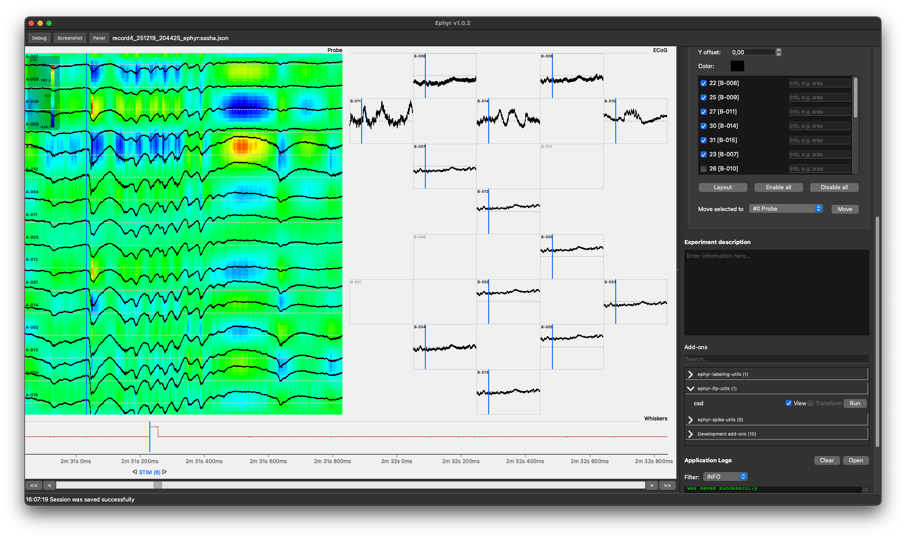

# Signal Panel

The signal panel is the main workspace for viewing and labeling recordings after an experiment session is loaded.

## How data is shown

Signal samples are loaded from the Ephyr experiment folder (`data/sweep_*/*.samples`) together with
`header.json`. Traces are arranged into **channel groups** defined in the current session’s GUI setup.

Each group can show a classic single-column stack of channels or a custom electrode grid (see
[Channel Management](settings_panel.md#channel-management)). Per-channel scale, color, Y offset, and
optional clipping apply when drawing.

## Events and periods

On top of the traces you can place:

- **Events** — vertical markers at a specific time in a sweep, colored by vocabulary entry. Events can be
  flagged as bad. Use the Events menu for vocabulary management and interactive add / remove / bad-flag modes.
- **Periods** — labeled intervals (optionally spanning sweeps). Use the Periods menu to manage vocabulary
  and to add intervals with two clicks.

Visibility of traces, events, and periods is controlled from **View** and stored in the session.

## Add-on overlays

Viewable add-ons draw additional graphics on the same panel after the base traces (and according to their
z-order relative to periods and events). A common example is **csd** (current source density) add-on. 
Another example is highlighted **spikes** from the Spike viewer
add-on: detection results stored under `add_ons/data/` are rendered as markers on the relevant channels.

Transformation add-ons do not draw; they change the numeric samples that feed the display pipeline before
filters and plotting. Runnable add-ons are started from the Add-ons settings section and may update
session labels or files that Viewable tools then display.

## Navigation under the plot

Below the traces:

1. **Event / period navigator** — a strip of labels for events and period starts/ends in the current view.
   Arrow controls jump to the previous or next occurrence of the same event name within the sweep and
   recenters the time window.
2. **Time controls** — `<<` `<` scrollbar `>` `>>`:
   - Scrollbar sets the window start sample
   - `<` / `>` step by the configured time step
   - `<<` / `>>` toggle auto-scroll using the auto-scroll interval and time step

You can also **drag horizontally on the plot to pan** (when not in an exclusive overlay mode) and use
**Ctrl/Cmd + scroll** to zoom duration around the cursor.

When a channel group uses a large custom grid, a small **group navigator** (arrows + minimap) appears so
you can pan the visible window of electrodes within that group.

## Interactive tools

| Mode | How to start                                | What it does |
|------|---------------------------------------------|--------------|
| Measurement bar | Press **M** (cycles: follow → freeze → off) | Crosshair with time and voltage scale bars |
| Full-view select | Press **V**                                 | Two clicks define a rectangle; opens a dialog with the selected area |
| Event / period modes | Events and Periods menus                    | Crosshair overlay for placing or editing labels; **Esc** or right-click cancels |
