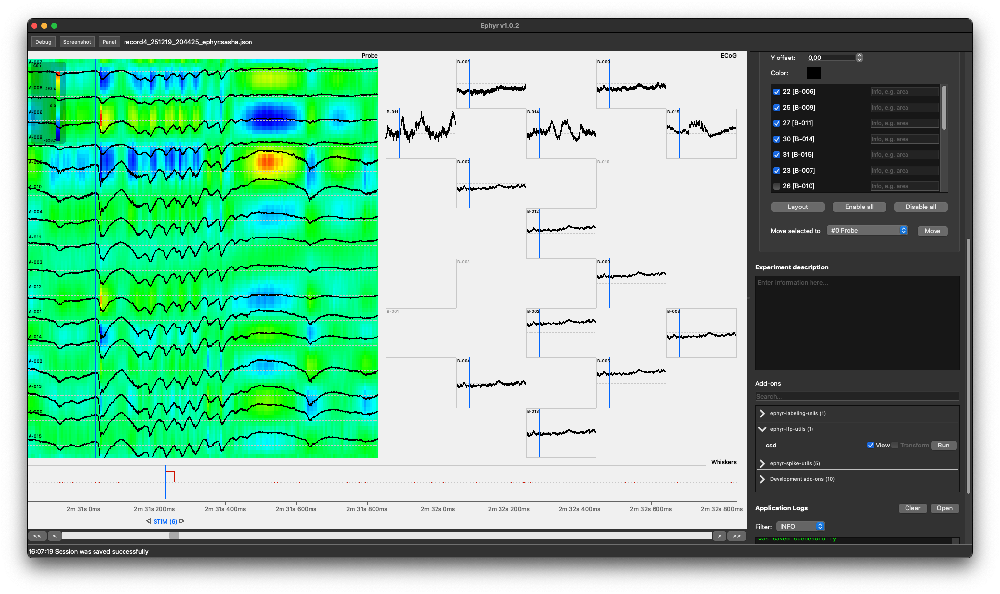

# Signal Panel

The signal panel is the main workspace for viewing and labeling recordings after an experiment session is loaded.

## How data is shown

Signal samples are loaded from the Ephyr experiment folder (`data/sweep_*/*.samples`) together with
`header.json`. Traces are arranged into **channel groups** defined in the current session’s GUI setup.

Each group can show a classic single-column stack of channels or a custom electrode grid (see
[Channel Management](settings_panel.md#channel-management)). Per-channel scale, color, Y offset, and
optional clipping apply when drawing. Channel name labels on each cell can be hidden with
**View → Channel names**. Global waveform visibility is **View → Channel Traces**.

## Events and periods

On top of the traces you can place:

- **Events** — vertical markers at a specific time in a sweep, colored by vocabulary entry. Events can be
  flagged as bad. Use **Events → Manage** for vocabulary and to add events; **Remove in Range**, **Set Bad**,
  and **Unset Bad** start the corresponding interactive modes.
- **Periods** — labeled intervals (optionally spanning sweeps). Use **Periods → Manage** for vocabulary
  and to add intervals with two clicks.

Global visibility of traces, channel names, events, and periods is controlled from **View**. Individual event
and period types can also be hidden in their vocabulary dialogs. Markers remain visible over disabled channel
cells. These settings are stored in the session.

## Add-on overlays

Viewable add-ons draw additional graphics on the same panel after the base traces (and according to their
z-order relative to periods and events). A common example is **csd** (current source density) add-on. 
Another example is highlighted **spikes** from the Spike viewer
add-on: detection results stored under `add_ons/data/` are rendered as markers on the relevant channels.

Transformation add-ons do not draw; they change the numeric samples that feed the display pipeline before
filters and plotting. Runnable add-ons are started from the Add-ons settings section and may update
session labels or files that Viewable tools then display.

## Navigation under the plot

Below the traces:

1. **Event / period navigator** — a strip of labels for events and period starts/ends in the current view.
   Arrow controls jump to the previous or next occurrence of the same event name within the sweep and
   recenters the time window. A period start has a right arrow that jumps to its end; a period end has a
   left arrow that jumps to its start, including periods whose boundaries are in different sweeps.
2. **Time controls** — `<<` `<` scrollbar `>` `>>`:
   - Scrollbar sets the window start sample
   - `<` / `>` step by the configured timebar step
   - `<<` / `>>` toggle auto-scroll: the view jumps by the timebar step on each frame, and the frame delay is how often that happens (1000 ms by default).
     In Beginner mode the timebar step is half of the visible duration window.

You can also **drag horizontally on the plot to pan** (when not in an exclusive overlay mode) and use
**Ctrl/Cmd + scroll** to zoom duration around the cursor.

When a channel group uses a large custom grid, a small **group navigator** (arrows + minimap) appears so
you can pan the visible window of electrodes within that group.

## Interactive tools

| Mode | How to start                                | What it does |
|------|---------------------------------------------|--------------|
| Scalebar | Header bar toggles on/off. **M** cycles follow → freeze → off | Time and voltage scale bars at the cursor |
| Zoom to area | Header bar or **V** | Two clicks define a rectangle; the cursor label is **Select area**. Opens a **Full-view selected area** dialog; **Export Canvas** saves or copies the view (PNG/SVG) |
| Event / period modes | Events and Periods menus                    | Crosshair overlay for placing or editing labels; **Esc** or right-click cancels |
